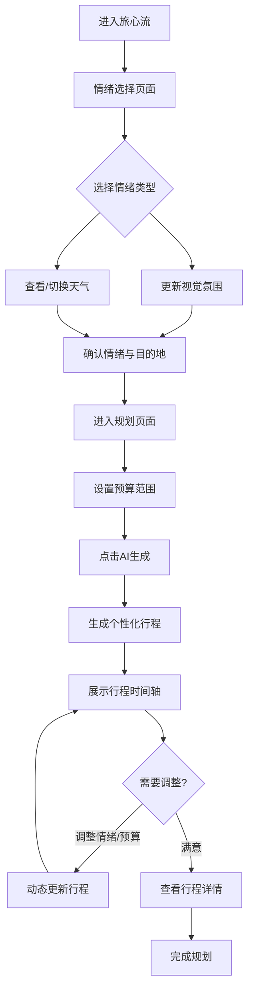

# 旅心流 (TravelFlow) - 产品需求文档

## 1. 产品概述
旅心流是一个创新的AI旅游规划助手，通过整合用户的情绪状态、目的地实时天气情况和预算限制，为用户生成个性化的旅行行程规划。产品旨在解决传统旅游规划工具缺乏个性化、无法适应用户实时状态变化的痛点，为旅行者提供更贴心、更符合当下心境的旅行体验。

**目标用户**：追求个性化旅行体验的现代旅行者，特别是重视情感体验和灵活调整计划的年轻群体（25-40岁）

**核心价值**：将情绪智能与旅行规划结合，让每次旅程都成为"心流"体验

## 2. 核心功能

### 2.1 用户角色
本产品为演示原型，暂不区分用户角色，采用单一访客模式。

### 2.2 功能模块
1. **情绪选择页**：情绪选择、视觉情绪反馈、天气预览
2. **行程规划页**：预算设置、AI行程生成、行程展示、动态调整

### 2.3 页面详情

| 页面名称 | 模块名称 | 功能描述 |
|---------|---------|---------|
| 情绪选择页 | 情绪轮盘 | 可视化情绪选择器，支持点击选择情绪类型（愉悦、放松、冒险、浪漫、沉思、活力等） |
| 情绪选择页 | 情绪背景 | 根据选择情绪动态变化的背景动画和配色 |
| 情绪选择页 | 天气卡片 | 展示目的地实时天气信息，支持城市切换 |
| 行程规划页 | 预算滑块 | 可视化预算设置工具，显示预算范围建议 |
| 行程规划页 | AI生成器 | 根据情绪+天气+预算生成个性化行程的交互按钮 |
| 行程规划页 | 行程时间轴 | 以时间轴形式展示规划好的行程，包含时间、地点、活动、预估费用 |
| 行程规划页 | 情绪天气标签 | 在行程卡片中显示匹配的情绪标签和天气适配标签 |
| 行程规划页 | 动态调整器 | 允许用户实时调整情绪或预算，行程随之动态更新 |

## 3. 核心流程

### 3.1 用户旅程描述
用户进入旅心流后，首先看到情绪选择界面，通过可视化情绪轮盘选择当前心情状态。选择情绪后，背景会动态变化以反映所选情绪的氛围。同时，用户可以查看或切换目的地的实时天气信息。

确认情绪和目的地后，进入行程规划页面。用户通过滑动设置预算范围，点击AI生成按钮后，系统根据情绪、天气和预算生成个性化行程。行程以时间轴形式展示，每个活动都标注了与情绪和天气的匹配度。

用户可以在任何时候调整情绪选择或预算设置，行程会实时动态更新。用户也可以点击单个行程卡片查看详情或手动调整。

### 3.2 流程图

## 4. 用户界面设计

### 4.1 设计风格

**色彩系统**：
- 主色调：渐变色系，随情绪动态变化
  - 愉悦：暖橙色 → 金黄色
  - 放松：薄荷绿 → 天蓝色
  - 冒险：深紫色 → 酒红色
  - 浪漫：玫瑰粉 → 淡紫色
  - 沉思：靛蓝色 → 灰蓝色
  - 活力：亮黄色 → 橙红色
- 辅助色：白色 (#FFFFFF)、深灰 (#2D3748)、浅灰 (#F7FAFC)
- 强调色：当前情绪主色的饱和度增强版

**视觉风格**：
- 流动性设计：使用柔和的渐变、波浪形状和流动动画体现"流"的概念
- 卡片式设计：圆角卡片 (border-radius: 16px-24px)，柔和阴影
- 玻璃态效果：半透明背景 + backdrop-filter 实现毛玻璃效果
- 微交互：悬停、点击时的流畅过渡动画

**字体系统**：
- 标题字体：思源黑体 (Source Han Sans) 或 Noto Sans SC，字重 600-700
- 正文字体：思源黑体 (Source Han Sans) 或 Noto Sans SC，字重 400-500
- 标题字号：32px-48px
- 正文字号：14px-18px
- 小字：12px

**图标与装饰**：
- 使用线性图标风格，线条粗细 2px
- 情绪图标采用手绘风格，增加亲和力
- 装饰元素：流动的线条、粒子效果、波浪图形

### 4.2 页面设计概览

| 页面名称 | 模块名称 | UI元素 |
|---------|---------|--------|
| 情绪选择页 | 情绪轮盘 | 圆形轮盘设计，6个情绪分区，悬停时放大并显示标签，点击时涟漪动画效果，选中状态：外圈发光 + 中心放大 |
| 情绪选择页 | 情绪背景 | 全屏渐变背景，流动粒子动画，颜色随情绪变化，使用 CSS 动画实现平滑过渡 |
| 情绪选择页 | 天气卡片 | 玻璃态卡片，城市名称 + 天气图标 + 温度 + 天气描述，支持点击切换城市，天气图标动画效果 |
| 行程规划页 | 预算滑块 | 自定义样式滑块，显示当前预算数值，预算区间标注（经济、舒适、豪华），滑动时显示建议信息 |
| 行程规划页 | AI生成器 | 大按钮设计，渐变背景 + 光晕效果，点击时脉冲动画 + 文字变化"正在生成..."，生成完成后播放庆祝动画 |
| 行程规划页 | 行程时间轴 | 垂直时间轴，左侧显示时间，右侧卡片展示活动，卡片包含：地点、活动描述、预估费用、情绪标签、天气标签，卡片进入时从右侧滑入，交错动画 |
| 行程规划页 | 动态调整器 | 浮动式控制面板，情绪快捷切换按钮，预算快捷调整滑块，显示"实时更新中..."提示，更新完成后提示"已更新 X 个活动" |

### 4.3 响应式设计
- 桌面优先设计，适配 1920px、1440px、1024px 宽度
- 移动端适配（375px-768px）：调整布局为单列，情绪轮盘简化为列表或网格
- 触摸优化：增大点击区域，优化滑动手势

### 4.4 动效与交互
- 页面切换：淡入淡出 + 滑动效果，时长 400-600ms
- 情绪选择：涟漪扩散动画，时长 800ms
- 背景变化：颜色渐变过渡，时长 1.2s
- 行程生成：加载动画（流动的线条或粒子聚合），生成过程 2-3s
- 卡片展示：交错出现动画，每张卡片延迟 100-150ms
- 微交互：所有按钮、滑块都有明确的悬停、按下、禁用状态反馈

### 4.5 无障碍设计
- 确保色彩对比度符合 WCAG AA 标准
- 为图标添加 aria-label
- 支持键盘导航
- 提供情绪文字描述，不只依赖颜色