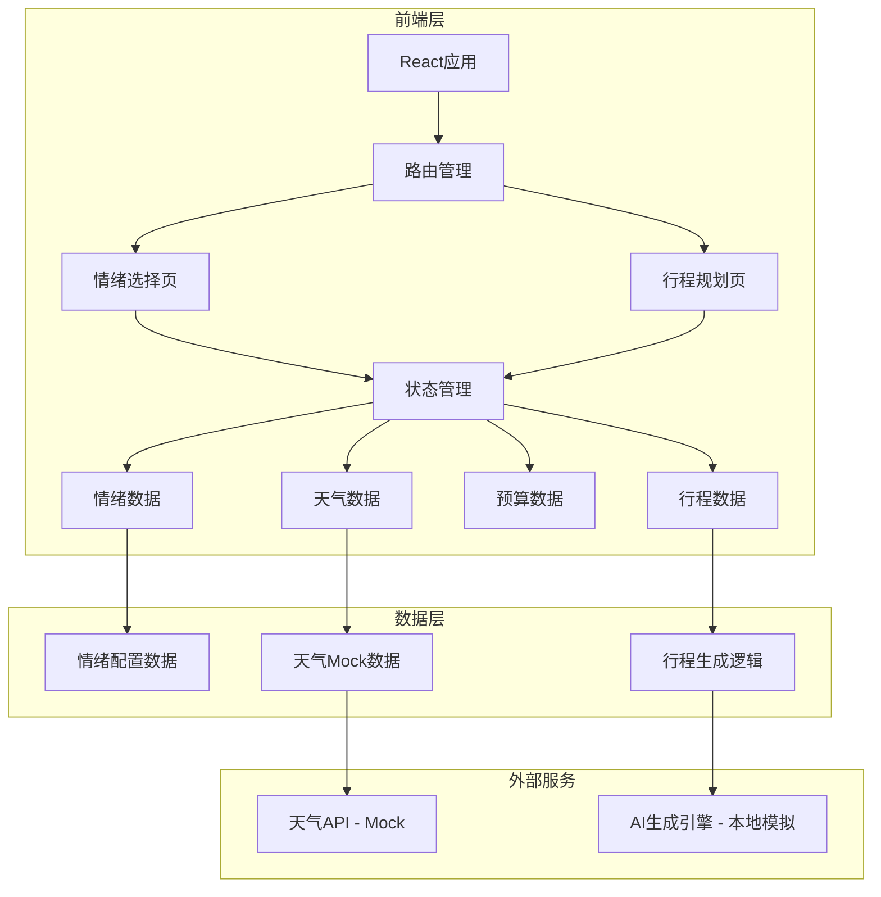

# 旅心流 (TravelFlow) - 技术架构文档

## 1. 架构设计



## 2. 技术描述

### 2.1 前端技术栈

* **框架**: React\@18.2.0

* **样式方案**: Tailwind CSS\@3.3.0 + CSS Modules

* **构建工具**: Vite\@4.4.0

* **动画库**: Framer Motion\@10.16.0（用于复杂动画和页面过渡）

* **图标库**: Lucide React（轻量级图标库）

### 2.2 项目结构

```
travel-flow/
├── src/
│   ├── components/          # 可复用组件
│   │   ├── EmotionWheel/    # 情绪轮盘组件
│   │   ├── WeatherCard/     # 天气卡片组件
│   │   ├── BudgetSlider/    # 预算滑块组件
│   │   ├── Timeline/        # 时间轴组件
│   │   ├── ActivityCard/    # 活动卡片组件
│   │   └── FloatingPanel/   # 浮动控制面板
│   ├── pages/               # 页面组件
│   │   ├── EmotionSelect/   # 情绪选择页
│   │   └── ItineraryPlan/   # 行程规划页
│   ├── data/                # Mock数据
│   │   ├── emotions.js      # 情绪配置数据
│   │   ├── weather.js       # 天气数据
│   │   └── activities.js    # 活动库数据
│   ├── hooks/               # 自定义Hooks
│   │   ├── useEmotion.js    # 情绪状态管理
│   │   ├── useWeather.js    # 天气数据获取
│   │   └── useItinerary.js  # 行程生成逻辑
│   ├── utils/               # 工具函数
│   │   ├── itineraryGenerator.js # 行程生成算法
│   │   └── colorUtils.js    # 颜色计算工具
│   ├── App.jsx              # 主应用组件
│   ├── main.jsx             # 应用入口
│   └── index.css            # 全局样式
├── public/
│   └── index.html           # HTML模板
├── package.json
├── vite.config.js           # Vite配置
└── tailwind.config.js       # Tailwind配置
```

### 2.3 状态管理

使用 React Context + useReducer 进行状态管理，管理以下全局状态：

* **当前情绪**: 包含情绪类型、对应颜色、描述

* **选中城市**: 目的地城市信息

* **天气数据**: 当前城市天气信息

* **预算范围**: 用户设置的预算值

* **行程数据**: 生成的行程列表

## 3. 路由定义

| 路由路径    | 页面名称  | 功能描述           |
| ------- | ----- | -------------- |
| `/`     | 情绪选择页 | 默认首页，情绪选择和天气查看 |
| `/plan` | 行程规划页 | 预算设置和行程生成展示    |

使用 React Router DOM v6 进行路由管理。

## 4. 数据模型

### 4.1 情绪数据模型

```javascript
// 情绪对象
{
  id: string,              // 情绪ID: 'joy', 'relax', 'adventure', etc.
  name: string,            // 情绪名称: '愉悦', '放松', etc.
  icon: string,            // 情绪图标名称
  colors: {
    primary: string,       // 主色: '#FF6B6B'
    secondary: string,     // 辅助色: '#FFE66D'
    gradient: string       // 渐变: 'linear-gradient(...)'
  },
  description: string,     // 情绪描述
  tags: string[]          // 相关标签: ['阳光', '活力']
}
```

### 4.2 天气数据模型

```javascript
// 天气对象
{
  city: string,            // 城市名称: '北京'
  cityId: string,          // 城市ID
  weather: string,         // 天气类型: '晴', '多云'
  temperature: number,     // 温度: 25
  humidity: number,        // 湿度: 60
  wind: string,           // 风力: '微风'
  icon: string,            // 天气图标名称
  suggestion: string      // 天气建议: '适合户外活动'
}
```

### 4.3 活动数据模型

```javascript
// 活动对象
{
  id: string,              // 活动ID
  name: string,            // 活动名称: '故宫博物院'
  location: string,        // 地点: '北京市东城区'
  description: string,     // 活动描述
  duration: number,        // 建议时长（小时）: 2.5
  cost: {
    min: number,          // 最低费用: 60
    max: number           // 最高费用: 100
  },
  tags: {
    emotions: string[],   // 匹配的情绪: ['愉悦', '沉思']
    weather: string[],    // 适合的天气: ['晴', '多云']
    categories: string[]  // 类别: ['文化', '历史']
  },
  image: string          // 活动图片URL（Mock）
}
```

### 4.4 行程项数据模型

```javascript
// 行程项对象
{
  id: string,              // 行程项ID
  activity: Activity,      // 活动对象
  startTime: string,       // 开始时间: '09:00'
  endTime: string,         // 结束时间: '11:30'
  estimatedCost: number,   // 预估费用
  emotionMatch: number,    // 情绪匹配度: 95
  weatherMatch: number     // 天气匹配度: 90
}
```

## 5. 核心算法

### 5.1 行程生成算法

```javascript
// 伪代码
function generateItinerary(emotion, weather, budget) {
  // 1. 从活动库中筛选符合情绪和天气的活动
  let candidates = activities.filter(activity => {
    return activity.tags.emotions.includes(emotion.id) &&
           activity.tags.weather.includes(weather.weather);
  });

  // 2. 根据预算过滤
  candidates = candidates.filter(activity => {
    return activity.cost.max <= budget * 0.8; // 保留20%缓冲
  });

  // 3. 计算匹配度得分
  candidates = candidates.map(activity => {
    return {
      ...activity,
      score: calculateScore(activity, emotion, weather)
    };
  });

  // 4. 按匹配度排序
  candidates.sort((a, b) => b.score - a.score);

  // 5. 生成时间轴行程
  return buildTimeline(candidates, budget);
}
```

### 5.2 颜色动态计算

```javascript
// 根据情绪生成渐变色
function generateEmotionGradient(emotion) {
  return `linear-gradient(135deg,
    ${emotion.colors.primary} 0%,
    ${emotion.colors.secondary} 100%)`;
}
```

## 6. Mock数据策略

### 6.1 情绪数据

预设6种情绪配置，包含完整的颜色方案和描述。

### 6.2 天气数据

预设3-5个城市的天气数据，支持城市切换。

### 6.3 活动库

预设15-20个活动，涵盖不同情绪、天气、预算的活动选项。

## 7. 性能优化

### 7.1 代码分割

* 使用 React.lazy 和 Suspense 进行路由级代码分割

* 按需加载组件

### 7.2 动画优化

* 使用 CSS transform 和 opacity 进行动画，避免触发重排

* 使用 will-change 提示浏览器优化

* 使用 Framer Motion 的 layout 动画优化性能

### 7.3 资源优化

* 图片使用 WebP 格式（如需）

* 使用 Tailwind CSS 的 purge 功能移除未使用的样式

* 压缩打包资源

## 8. 浏览器兼容性

* 支持 Chrome、Firefox、Safari、Edge 最新两个主版本

* 使用 CSS Grid 和 Flexbox 布局

* 使用 CSS 自定义属性（CSS Variables）

* 使用 backdrop-filter 特性（需降级方案）

## 9. 部署说明

本产品为演示原型，采用纯前端静态部署：

* 打包生成静态文件：`npm run build`

* 部署到任何静态文件服务器或 CDN

* 支持 Vercel、Netlify 等平台一键部署

